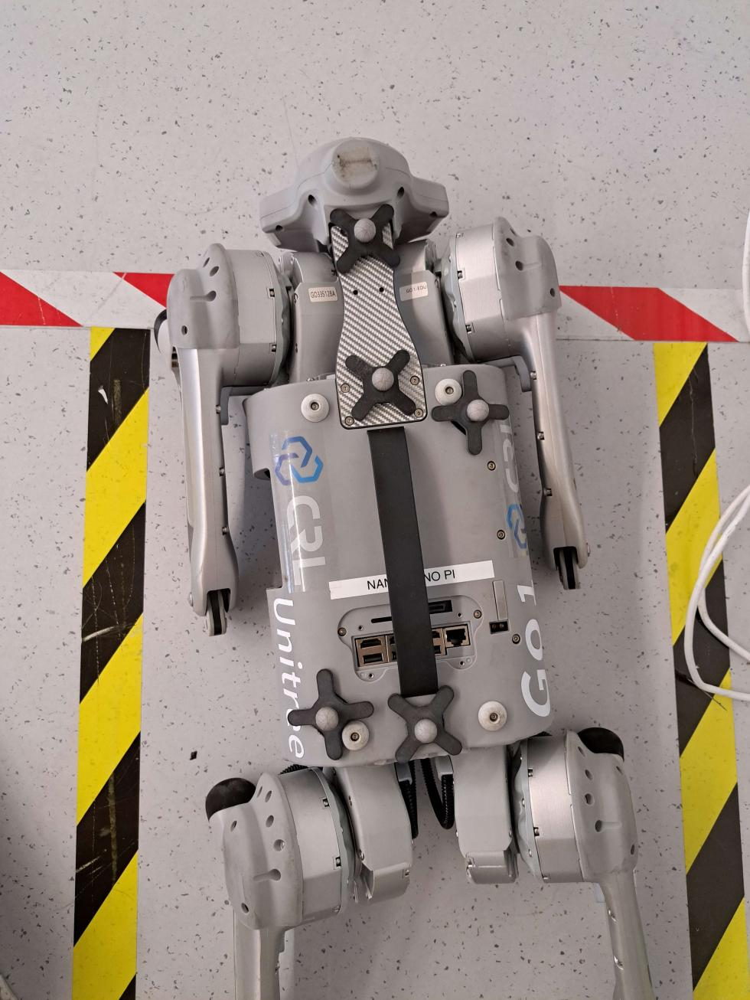

# crl-optitrack-ros

## Hardware Setup

1. Ensure the markers are setup correctly on the robot in the following pattern. Note that the middle 3 trackers are on a straight line and the side trackers are hugging the round rubber point.

2. Open Motive and check if there is already a rigidbody named "Go1Gamma". If there is proceed to step 4.

3. Create a rigidbody using the 5 markers. Since we need to align the rigidbody x-axis with the robot, put the robot into stand mode and face the robot towards the front of the room.

4. Check the x-axis is aligned with the 3 middle trackers in motive. If it isn't, then adjust it in the Motive software.

5. Set the channel ID of the rigidbody to 1010. Currently, this value is hardcoded in the software package, but can be changed easily by modifying code if desired.

## Motive PC setup

1. Create a VS Developer Prompt (note that a normal command prompt will not work).

2. Clone the `crl-optitrack-ros` package. Currently, it is at `C:\Users\Panda\Desktop\crl_optitrack_ros_main`.

3. Source ROS2 by executing `C:\ros\humble\setup.bat`.

4. Compile `crl-optitrack-ros` using `colcon` and source `install\setup.bat`.

5. Execute `ros2 run optitrack_adaptor adaptor_runner --ros-args --params-file optitrack_adaptor\config\crl_lab_optitrack.yaml`. Currently, the config file is set to automatically discover and connect to Motive. Should this be changed, modify the `crl_lab_optitrack.yaml` file.

6. Check if the topic `/optitrack_adaptor/mocap_frame` is available and is publishing correct values.

## User PC setup

1. Clone the `crl-optitrack-ros` repository. and build it.

2. Source `install/setup.sh`.

3. Check if the topic `/optitrack_adaptor/mocap_frame` is available and is publishing correct values.

4. Use the `MocapReceiveNode.h` defined in `crl_humanoid_commons` to process communication with the MoCap system.
